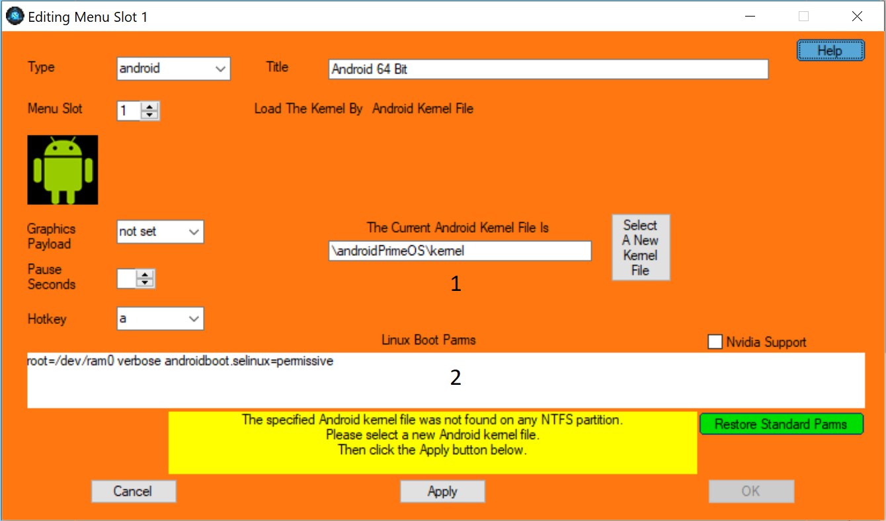

Due to how Android-x86 is structured, it can be installed in any system. It mainly depends if the boot-loader can boot the system from that File-System. 

But since its forked from Linux, it has the best performance in Ext4 File-System.

Here we are gonna learn `How to Install Android-x86 on NTFS/ext4`. But the process is similar in any File-System.  

## Preparation

To install Android-x86 we are gonna need 3-4 things.

1. The boot-loader or Grub or Grub2win
2. The ISO of course
3. A tool to create the `data.img` (For example [makeData](https://mega.nz/file/VxggALRD#_q4_JkkpTe-2s9-1nbI9v_bkwMeDyMmG2DYHLd4G5FY)).
4. [Ex2fsd](http://www.acc.umu.se/~bosse/ext2fsd/0.53/Ext2Fsd-0.53.exe) + a partition manager that supports ext4 formatting if you want to work with ext4 File-System

## Step-1 The Android-x86 Folder

Android-x86 can be booted from root of partition or from any folder or sub-folder. We are going to install it in a sub-folder `Android_x86` in `App` folder in our D drive. After creating the folder copy the `kernel`,`ramdisk.img`,`system.img/system.sfs`,`initrd.img`,`gearlock`(if exists) from the ISO to the folder. 

And that's step-1.

### Note for Ext4

Use a partition manager to format partition as ext4. Than use Ext2fsd to assign drive letter to access it from File Explorer.

## Step-2 The Data Partition

Use any tool or the `makeData` tool to create `data.img` file. This will serve as the SD-card for the system. `makeData` will ask for SD-card size in GB. Provide at least 8 GB for efficient gaming. Now move that created data file to the folder where we copied files from ISO to(Android_x86 folder in App folder).

!!!warning Warning
Please don't use `data.img` of one installation on another. Create a fresh data on every install. Or the system might not boot.
!!!

### Note for Ext4

You don't need to create `data.img` as Androidx86 natively supports this File-System. So just a folder named `data` will do.

## Step-3 The Bootloader

Now the last part. Install Grub2win from [here](https://sourceforge.net/projects/grub2win/). Please don't use any external links as there are reports of malware injected inside them. After installation open Grub2win. Go to `Manage boot menu` and select `Add entry`. Select type as Android, Give a name and at last click the `Select A new Android Kernel File` button. This will open a explorer. Now browse to the folder where we copied the files from ISO and open the kernel file. The texts in box 1 and 2 should change according to your folder. Append any kernel parameter you want to add to box 2. Hit apply and your done.

## Step-4 Another Step?

No this is just some warnings and tips for your better experience.

1. Don't use the `Ext2fsd` too much as it is not 100% accurate and might kill the Androidx86. Instead use the `FX Explorer` app as `NTFS` partitions are mounted in it.
2. There is no such thing as best Android-x86. If the system runs slow, try changing the kernel/mesa or apply some tweaks from `gearlock` or `lspeed`,`FDE`.
3. There is no such thing as best kernel/mesa. Each device works with specific kernel. Some devices works on all. And there's no magic word to tell which will work for your device. Just pick 4.19 series of kernel and mesa 18 and try to go up and down.
4. If you got NVidia GPU, pray to God that it works or just use emulator if GPU is good enough.
5. Install kernel/mesa from `gearlock recovery`.

Happy Gaming ;)
